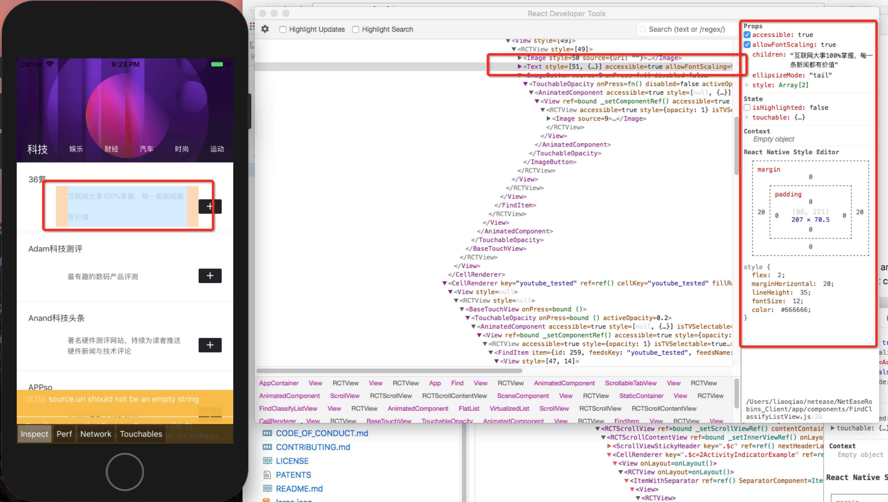
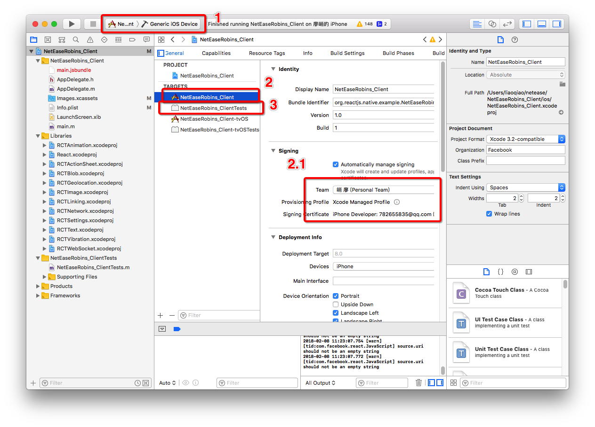

# ReactNative Mac调试技巧

工欲善其事，必先利其器。上篇文章快读搭建并运行一个App应用，但离工程化开发还是远不够的。调试程序是开发过程中必不可少的，高效的调试技能可以提高开发效率，也可以及时发现bug。

启动RN应用时，同时会启一个package server的node应用（可以理解为webpack功能），每次修改js代码，不需要重新run xcode，该server服务会把最新的js代码编译并提供给Native代码调用。

## 调试技巧清单

- React Native调试菜单

- chrome developer tool

- react-devtools

- Charles抓包工具

- 真机调试

## React Native调试菜单

`Command⌘ + D`即可调出调试菜单，里面有我们经常使用的调试功能。


>提示：如果`Command⌘ + D`无法打开，是因为模拟器与键盘断开连接了，可以在Xcode中Hardware menu->Keyboard->"Connect Hardware Keyboard"

### Reload

重新编译App，相当于Web的F5。快捷键`Command⌘ + R`

### Hot Reloading

热加载，做过Webpack工程化项目的人再熟悉不过。如果每次修改代码后需要手动刷新，效率值大大降低，热加载可以在保存代码后，自动进行增量包编译，实现模拟器的自动刷新。

### Enable Live Reload

ReactNative还给开发者提供了自动刷新的功能，也可以对代码自动刷新。这里和Hot Reloading的区别是Live Reload是全量刷新，每次保存代码都会自动生成bundle包并发送到手机上，使得应用初始化。

### Show Inspector
方便的查看到当前选中元素的位置、样式、层级关系、盒子模型信息等等，类似Chrome Elements Tab

## Chrome Developer Tools

强大的Chrome可以像调试js那样来调试React Native应用。方式类似webpack的sourcemap，可以对源代码进行断点调试

#### 第一步：启动远程调试

在Developer Menu下单击"Debug JS Remotely" 启动JS远程调试功能。Chrome自动打开Tab页：“http://localhost:8081/debugger-ui”

#### 第二步：打开开发者工具
快捷键：`Command⌘ + Option⌥ + I`

#### 第三部：断点调试
选中需要调试的代码行。


>tips：在控制台(Console)上打印变量，执行脚本等操作。在开发调试中非常有用

## react-devtools

rn调试菜单'Show Inspector'虽然可以让开发者可以看到层级和相关样式，但展现在app中过小，也无法像Chrome elements一样，实时修改。这里推荐使用react-devtools工具，让你轻松完成这一切。配合debugger或show inspector更强大

安装

``` shell
npm install -g react-devtools
```

使用
``` shell
react-devtools
```



> tips:该工具同样支持ReactJS哦

## Charles抓包工具

reactnative的网络请求，在chrome中无法捕捉，所以需要使用抓包工具查看网络请求详细信息。Mac推荐[Charles](https://www.charlesproxy.com/)工具

## 真机调试

### IPhone

目前网上大部分真机调试的文章都是基于以前的版本，在笔者最新的版本`v0.52`已经不再需要代码替换IP地址来得到打包的JSBundle。IOS本机测试需要Apple ID账号，如果需要发布到AppStore，则需要Devloper ID。经过测试，流程如下：

1. USB连接真机，xcode中设备选择真机

2. 单击项目名，Target的ProjectName和ProjectNameTest中**Signing**选项，Team中选择你已经绑定到Apple ID账号。如果没有选择列表，该地方会让你登陆一个账号。

3. 单击运行即可在真机中查看App运行。晃动手机也可以调出调试菜单



### Android

1. 根目录下执行`npm start`,确保package server启动,[localhost:8081](http://localhost:8081)可以访问

2. 使用adb reverse命令。`adb reverse tcp:8081 tcp:8081`

3. 晃动设备，打开开发者菜单，点击`Dev Settings` -> `Debug server host for device` -> 输入本机IP和8081端口

4. 完成后晃动设备，选择`Reload JS`即可

### 相关链接

 [React中文网](https://reactnative.cn/docs/0.51/debugging.html)

 [react-devtools](https://github.com/facebook/react-devtools)
